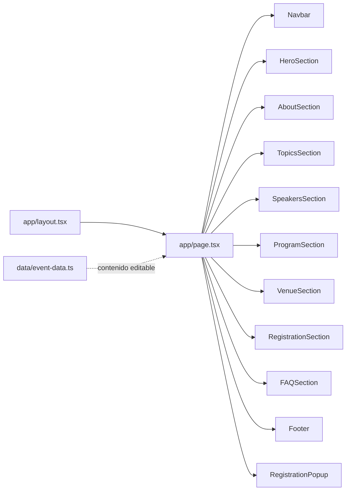
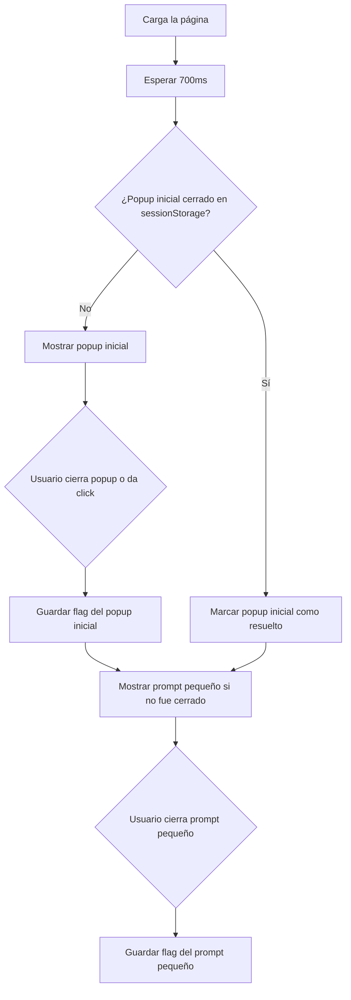

# Documentación Landing page

**2da Jornada Académica: Microbiota y sus implicaciones en la era de los bióticos**.
**Solicitud hecha por el área de Difusión**

Última revisión: 24 de junio de 2026.

---

## Índice

1. [Resumen Ejecutivo](#resumen-ejecutivo)
2. [Stack Técnico](#stack-técnico)
3. [Cómo Correr El Proyecto](#cómo-correr-el-proyecto)
4. [Estructura General y Carpetas Principales](#estructura-general-y-carpetas-principales)
5. [Flujo De Renderizado](#flujo-de-renderizado)
6. [Mapa De Componentes](#mapa-de-componentes)
7. [Componentes Cliente E Interactividad](#componentes-cliente-e-interactividad)
8. [Diseño, Estilos Y Sistema Visual](#diseño-estilos-y-sistema-visual)
9. [Imágenes Y Assets](#imágenes-y-assets)
10. [Flujo De Registro](#flujo-de-registro)
11. [Programa Académico](#programa-académico)
12. [SEO Y Metadata](#seo-y-metadata)
13. [Validación Y Calidad](#validación-y-calidad)
14. [Guías De Mantenimiento](#guías-de-mantenimiento)
15. [Riesgos, Pendientes Y Oportunidades](#riesgos-pendientes-y-oportunidades)

---

## Resumen Ejecutivo

Este proyecto es una landing page desarrollada con **Next.js**, **React**, **TypeScript** y **Tailwind CSS**. Su objetivo principal es apoyar al área de difusión para presentar el evento académico, comunicar información clave y dirigir a los usuarios al registro.

La arquitectura está pensada para que la mayor parte del contenido editable viva en un solo archivo:

```txt
data/event-data.ts
```

Eso permite modificar textos, fechas, speakers, programa, sede, costos, preguntas frecuentes y enlaces sin tocar la mayoría de los componentes visuales.

La página se compone de secciones apiladas:

```txt
Navbar
Hero
Acerca
Temas
Speakers
Programa
Sede
Registro
FAQ
Footer
Popup de registro
```

El archivo que ensambla todo es:

```txt
app/page.tsx
```

---

## Stack Técnico

| Área      | Tecnología                      | Uso                                                 |
| --------- | ------------------------------- | --------------------------------------------------- |
| Framework | Next.js 16.2.7                  | App Router, metadata y optimización de imágenes     |
| UI        | React 19.2.4                    | Componentes server/client                           |
| Lenguaje  | TypeScript                      | Tipado estático y seguridad estructural             |
| Estilos   | Tailwind CSS v4                 | Clases utilitarias y diseño responsive              |
| Lint      | ESLint 9 + `eslint-config-next` | Reglas de Next, React, TypeScript y Core Web Vitals |
| Assets    | `public/images`                 | Imágenes estáticas servidas desde `/images/...`     |

No hay dependencias extra de UI, animación, iconos o formularios. Esto mantiene el proyecto ligero y fácil de entender.

---

## Cómo Correr El Proyecto

Desde la raíz del proyecto:

```bash
cd "/Users/programacionti/Documents/Mau/ProyectosNext/landing page/landing-evento"
npm run dev -- --hostname 127.0.0.1 --port 3000
```

Abrir:

```txt
http://127.0.0.1:3000
```

---

## Estructura general y carpetas principales

```txt
landing-evento/
├─ app/
│  ├─ globals.css
│  ├─ layout.tsx
│  └─ page.tsx
├─ components/
│  ├─ AboutSection.tsx
│  ├─ CountdownTimer.tsx
│  ├─ DecorativeBioticsPattern.tsx
│  ├─ FAQSection.tsx
│  ├─ Footer.tsx
│  ├─ HeroSection.tsx
│  ├─ Navbar.tsx
│  ├─ ProgramSection.tsx
│  ├─ ProgramTimeline.tsx
│  ├─ RegistrationPopup.tsx
│  ├─ RegistrationSection.tsx
│  ├─ SectionHeader.tsx
│  ├─ SmoothScrollLink.tsx
│  ├─ SpeakerCard.tsx
│  ├─ SpeakersSection.tsx
│  ├─ StatsSection.tsx
│  ├─ TopicsSection.tsx
│  └─ VenueSection.tsx
├─ data/
│  └─ event-data.ts
├─ public/
│  └─ images/
│     ├─ hero/
│     ├─ ponentes/
│     └─ temas/
├─ next.config.ts
├─ package.json
├─ postcss.config.mjs
├─ eslint.config.mjs
└─ tsconfig.json
```

| Carpeta          | Responsabilidad                                                                   |
| ---------------- | --------------------------------------------------------------------------------- |
| `app/`           | Entrada de Next.js App Router: layout global, página principal y estilos globales |
| `components/`    | Secciones visuales y componentes reutilizables                                    |
| `data/`          | Datos editables del evento y tipos TypeScript                                     |
| `public/images/` | Imágenes estáticas del hero, temas y speakers                                     |

---

## Flujo De Renderizado

El flujo principal es:



### `app/layout.tsx`

Responsabilidades:

- Define el idioma del documento como español: `<html lang="es">`.
- Inyecta los estilos globales desde `app/globals.css`.
- Define metadata usando `eventData.metadata`.
- Aplica texto base oscuro en el `<body>`.

Detalle importante:

```tsx
export const metadata: Metadata = {
  title: eventData.metadata.title,
  description: eventData.metadata.description,
  keywords: [...eventData.metadata.keywords],
};
```

Esto significa que el SEO básico se modifica desde `eventData.metadata`, no directamente desde `layout.tsx`.

## Fuente De Verdad: `event-data.ts`

El archivo:

```txt
data/event-data.ts
```

Tiene los campos editables

### `app/page.tsx`

Responsabilidades:

- Ensambla la landing completa.
- Mantiene el orden visual de las secciones.
- Inserta `RegistrationPopup` al final para que pueda flotar sobre el contenido.

No contiene lógica de negocio. Es un archivo de composición.

---

### Tipos Exportados

| Tipo          | Para qué sirve                            |
| ------------- | ----------------------------------------- |
| `NavItem`     | Define los tabs/enlaces del navbar        |
| `HeroStat`    | Tarjetas de datos rápidos dentro del hero |
| `MetricCard`  | Métricas del evento en Acerca             |
| `Topic`       | Temas principales                         |
| `Speaker`     | Cards de speakers                         |
| `ProgramItem` | Cada bloque de programa                   |
| `ProgramDay`  | Día del programa                          |
| `AccessLevel` | Opciones de acceso y costos               |
| `FAQItem`     | Preguntas frecuentes                      |

### `eventData.event`

Este objeto es crítico porque alimenta varias partes:

```ts
event: {
  date: "09 de septiembre de 2026",
  time: "9:00 AM - 6:00 PM",
  location: "Puebla, México",
  city: "Puebla, México",
  modality: "Presencial y en línea",
  registrationLink: "#registro",
  paymentLink: "https://www.yakultpuebla.com.mx/",
  contactEmail: "contacto@yakultpuebla.org",
  countdownTargetDate: "2026-09-09T08:30:00-06:00",
}
```

Uso por campo:

| Campo                 | Dónde se usa                        |
| --------------------- | ----------------------------------- |
| `date`                | Hero stats, sede, programa          |
| `time`                | Sede                                |
| `modality`            | Hero stats                          |
| `registrationLink`    | Navbar y algunos CTAs internos      |
| `paymentLink`         | Botón principal de registro y popup |
| `contactEmail`        | Registro y footer                   |
| `countdownTargetDate` | Cuenta regresiva                    |

### Nota Sobre `registrationLink` Y `paymentLink`

Hay dos conceptos distintos:

```ts
registrationLink: "#registro";
paymentLink: "https://www.yakultpuebla.com.mx/";
```

- `registrationLink` manda a la sección interna de registro.
- `paymentLink` manda al enlace externo donde se realizará el pago/registro real.

Esto permite que el navbar no saque al usuario del sitio, pero el CTA principal sí pueda enviarlo al flujo externo.

---

## Mapa De Componentes

### Secciones En Orden De Aparición

| Orden | Componente            | Tipo    | Responsabilidad                                           |
| ----- | --------------------- | ------- | --------------------------------------------------------- |
| 1     | `Navbar`              | Cliente | Navegación fija, sección activa y scroll horizontal móvil |
| 2     | `HeroSection`         | Server  | Hero principal con imagen optimizada y cuenta regresiva   |
| 3     | `AboutSection`        | Server  | Descripción, highlights y modalidades                     |
| 4     | `TopicsSection`       | Server  | Cards de temas con fondo visual                           |
| 5     | `SpeakersSection`     | Server  | Sección de speakers con filas centradas                   |
| 6     | `ProgramSection`      | Server  | Sección contenedora del programa académico                |
| 7     | `VenueSection`        | Server  | Sede, datos logísticos y mapa embebido                    |
| 8     | `RegistrationSection` | Server  | Pasos, costos y CTAs de registro                          |
| 9     | `FAQSection`          | Server  | Preguntas frecuentes con `<details>`                      |
| 10    | `Footer`              | Server  | Enlaces rápidos, contacto y cierre institucional          |
| 11    | `RegistrationPopup`   | Cliente | Popup inicial y prompt persistente flotante de registro   |

`RegistrationPopup` se monta al final en `app/page.tsx`, pero visualmente flota sobre la landing; por eso aparece en esta tabla como una experiencia transversal, no como una sección con espacio propio.

### Componentes Reutilizables Y Auxiliares

| Componente         | Tipo    | Lo usan principalmente             | Responsabilidad                                           |
| ------------------ | ------- | ---------------------------------- | --------------------------------------------------------- |
| `SectionHeader`    | Server  | Secciones de contenido             | Encabezado reutilizable con eyebrow, título y descripción |
| `SmoothScrollLink` | Cliente | Navbar, registro, footer y prompts | Scroll interno suave y manejo seguro de links externos    |
| `CountdownTimer`   | Cliente | `HeroSection`                      | Cuenta regresiva en tiempo real                           |
| `SpeakerCard`      | Server  | `SpeakersSection`                  | Card individual de speaker con fondo y degradado          |
| `ProgramTimeline`  | Server  | `ProgramSection`                   | Línea de tiempo alternada del programa                    |

---

## Componentes Cliente E Interactividad

En Next.js App Router, los componentes son Server Components por defecto. Este proyecto marca como cliente solo los que necesitan navegador, estado o efectos:

```txt
Navbar.tsx
CountdownTimer.tsx
RegistrationPopup.tsx
SmoothScrollLink.tsx
```

### `Navbar.tsx`

Archivo:

```txt
components/Navbar.tsx
```

Responsabilidades:

- Renderiza el header fijo.
- Lee `eventData.navItems`.
- Marca la sección activa según el scroll.
- Maneja navegación horizontal en móvil con botones anterior/siguiente.

### `SmoothScrollLink.tsx`

Archivo:

```txt
components/SmoothScrollLink.tsx
```

Responsabilidades:

- Maneja links internos tipo `#programa`.
- Respeta links externos tipo `https://...`.
- Ajusta el scroll considerando la altura del navbar.
- Actualiza el hash con `history.replaceState`.

Comportamiento importante:

- Si `href` empieza con `http://` o `https://`, se abre como enlace externo.
- Si `href` empieza con `#`, evita el comportamiento default y calcula el scroll manualmente.
- Si el usuario hace Cmd/Ctrl/Shift-click, no intercepta el evento.

Esto evita romper comportamientos esperados del navegador.

### `CountdownTimer.tsx`

Archivo:

```txt
components/CountdownTimer.tsx
```

Responsabilidades:

- Calcula días, horas, minutos y segundos hasta `eventData.event.countdownTargetDate`.
- Actualiza cada segundo con `setInterval`.
- Tiene dos variantes visuales:
  - `hero`
  - `page`

Casos manejados:

- Fecha inválida: muestra “Fecha del simposium por confirmar”.
- Fecha ya pasada: muestra “El Simposium ha comenzado”.
- Fecha futura: muestra contador.

Punto importante:

```ts
const eventDate = useMemo(
  () => new Date(eventData.event.countdownTargetDate).getTime(),
  [],
);
```

`useMemo` evita recalcular la fecha en cada render.

### `RegistrationPopup.tsx`

Archivo:

```txt
components/RegistrationPopup.tsx
```

Responsabilidades:

- Muestra un popup inicial de registro.
- Muestra un prompt pequeño fijo en la parte inferior.
- Evita que ambos se encimen.
- Recuerda cierres usando `sessionStorage`.
- Permite cerrar con `Escape`.

Flujo actual:



Claves usadas en `sessionStorage`:

```ts
yakult - registration - entry - prompt - dismissed;
yakult - registration - scroll - prompt - dismissed;
```

Aunque el segundo se llama `scroll-prompt`, actualmente ya no depende del scroll. El nombre quedó por historia del desarrollo.

### Por Qué `sessionStorage`

`sessionStorage` recuerda el cierre solo dentro de la misma pestaña/sesión. Cuando el usuario abre una sesión nueva, los prompts pueden volver a aparecer.

Si en el futuro se quiere ocultar por varios días, conviene migrar a `localStorage` con fecha de expiración.

---

## Diseño, Estilos Y Sistema Visual

### Archivo Global

```txt
app/globals.css
```

Define:

- Tokens CSS principales.
- Tema inline de Tailwind v4.
- Reset básico de `box-sizing`.
- Scroll suave.
- Estilos globales de transición.
- Clases utilitarias propias.
- Animaciones.
- Reducción de movimiento para usuarios con `prefers-reduced-motion`.

### Clases Propias

| Clase                | Uso                                             |
| -------------------- | ----------------------------------------------- |
| `.text-block`        | Texto largo con color y line-height consistente |
| `.symbi-card`        | Card blanca con borde suave                     |
| `.symbi-card-subtle` | Card secundaria con fondo gris translúcido      |
| `.fade-in-up`        | Animación de entrada vertical                   |
| `.bg-pattern-band`   | Preparada para fondos decorativos               |

### Nota De Tailwind v4

El proyecto usa Tailwind v4 con:

```css
@import "tailwindcss";
```

y configuración PostCSS:

```js
plugins: {
  "@tailwindcss/postcss": {},
}
```

No hay `tailwind.config.js` tradicional. Las clases se usan directamente en los componentes.

---

## Imágenes Y Assets

Todas las imágenes están en:

```txt
public/images/
```

Se sirven con rutas públicas:

```txt
/images/hero/hero2.png
/images/ponentes/speaker1.jpg
/images/temas/tema1.jpg
```

### Hero

`HeroSection` usa `next/image`:

```tsx
<Image
  src="/images/hero/hero.png"
  alt=""
  fill
  preload
  sizes="100vw"
  className="pointer-events-none absolute inset-0 z-0 object-cover object-center"
  aria-hidden
/>
```

Puntos importantes:

- `fill` hace que la imagen cubra el contenedor padre.
- `sizes="100vw"` indica que la imagen ocupa el ancho completo del viewport.
- `preload` ayuda porque el hero suele ser el Largest Contentful Paint.
- `object-cover` puede recortar la imagen si la proporción del contenedor no coincide con la proporción de la imagen.
- `alt=""` y `aria-hidden` indican que la imagen es decorativa; el contenido real está en texto HTML.

### Recomendación De Hero

Para mejorar control responsive:

| Contexto       | Proporción sugerida | Tamaño recomendado        |
| -------------- | ------------------- | ------------------------- |
| Móvil          | Portrait            | 1080 x 1920 o 1200 x 1800 |
| Desktop normal | 2:1                 | 2560 x 1280               |
| Ultrawide      | 3:1                 | 3000 x 1000 o 3792 x 1296 |

### Temas

`TopicsSection` usa un arreglo local:

```ts
const topicImages = [
  "/images/temas/tema1.jpg",
  ...
];
```

Luego asigna imagen por índice:

```ts
const topicImage = topicImages[index % topicImages.length];
```

El operador `%` evita errores si hay más temas que imágenes: cuando se acaban las imágenes, vuelve a empezar desde la primera.

### Speakers

Cada speaker define su imagen en `eventData.speakers[n].photo`.

Ejemplo:

```ts
photo: "/images/ponentes/speaker1.jpg";
```

`SpeakerCard` la usa como fondo con un degradado radial para mejorar legibilidad del texto.

---

## Flujo De Registro

El registro aparece en tres lugares principales:

1. Navbar.
2. Sección `Registro`.
3. Popup/prompt flotante.

### Navbar

Usa:

```ts
eventData.event.registrationLink;
```

Actualmente:

```txt
#registro
```

Esto hace que el botón del navbar lleve a la sección interna de registro.

### Botón Principal De Registro

En `RegistrationSection` y `RegistrationPopup` se usa:

```ts
eventData.event.paymentLink;
```

Actualmente:

```txt
https://www.yakultpuebla.com.mx/
```

Ese enlace puede cambiarse cuando exista la liga final de pago o registro externo.

### Popup De Registro

`RegistrationPopup` tiene dos piezas:

| Pieza          | Cuándo aparece                                           | Objetivo                                |
| -------------- | -------------------------------------------------------- | --------------------------------------- |
| Popup inicial  | 700ms después de cargar, si no se cerró en la sesión     | Dar una llamada clara al registro       |
| Prompt pequeño | Desde el inicio, cuando el popup inicial no está abierto | Mantener acceso al registro sin invadir |

Botones:

- `Registrarme ahora`: va a `paymentLink`.
- `Ver detalles`: va a `#registro`.
- `X`: cierra y guarda estado en sesión.

---

## Programa Académico

El programa se compone de:

```txt
ProgramSection
└─ ProgramTimeline
```

### `ProgramSection`

Solo renderiza encabezado y pasa datos:

```tsx
<ProgramTimeline days={eventData.program.days} />
```

### `ProgramTimeline`

Actualmente toma solo el primer día:

```ts
const currentDay = days[0];
```

Esto está alineado con el contenido actual, que tiene un solo día de programa.

Si en el futuro vuelve a haber varios días, hay dos caminos:

1. Reintroducir tabs/selector de día.
2. Renderizar varias timelines una debajo de otra.

---

## Secciones De Contenido

### `AboutSection`

Usa:

- `eventData.about.title`.
- `eventData.about.description`.
- `eventData.highlights`.
- `eventData.about.modalityCards`.

Detalles:

- La descripción soporta saltos de línea gracias a `SectionHeader` con `whitespace-pre-line`.
- Los highlights son cards compactas.

### `TopicsSection`

Usa:

- `eventData.topics`.
- Imágenes locales de `public/images/temas`.

Cada card:

- Tiene fondo de imagen.
- Tiene degradado radial en esquina inferior derecha.
- Tiene texto alineado abajo a la derecha.

### `SpeakersSection` Y `SpeakerCard`

`SpeakersSection` usa `flex-wrap` con `justify-center`, no grid tradicional.

Esto permite:

- 3 + 2 centrado en pantallas grandes.
- 2 + 2 + 1 centrado en pantallas medianas.
- 1 por fila en móvil.

`SpeakerCard`:

- Usa la foto como fondo.
- Aplica degradado radial para legibilidad.
- Renderiza `institution` y `location` solo si no están vacíos.

Esto evita espacios verticales innecesarios cuando esos campos todavía no se tienen.

### `VenueSection`

Usa:

- `eventData.venue`.
- `eventData.event.date`.
- `eventData.event.time`.

Genera un iframe de Google Maps:

```ts
const venueMapQuery = encodeURIComponent(
  `${eventData.venue.address}, ${eventData.venue.city}`,
);
```

Esto evita escribir una URL manual de Google Maps. Si cambia dirección o ciudad, el mapa se actualiza automáticamente.

### `FAQSection`

Usa:

```ts
eventData.faq;
```

Renderiza preguntas con `<details>` y `<summary>`, que son elementos nativos del navegador para disclosure/accordion.

### `Footer`

Usa:

- `eventData.brand`.
- `eventData.event.contactEmail`.
- `eventData.footer.quickLinks`.
- `eventData.footer.social`.

Tiene un `quickMap` interno que traduce nombres de links a hashes de secciones.

Si se agrega un nuevo link en `eventData.footer.quickLinks`, también debe agregarse al `quickMap` si no existe.

---

## SEO Y Metadata

El SEO base se controla desde:

```txt
data/event-data.ts
```

Objeto:

```ts
metadata: {
  title: "...",
  description: "...",
  keywords: [...]
}
```

`app/layout.tsx` lo consume así:

```ts
export const metadata: Metadata = {
  title: eventData.metadata.title,
  description: eventData.metadata.description,
  keywords: [...eventData.metadata.keywords],
};
```

Área de oportunidad para mejorar el SEO.

---

## Guías De Mantenimiento

### Cambiar Fecha Del Evento

Editar:

```ts
eventData.event.date;
eventData.event.time;
eventData.event.countdownTargetDate;
```

Importante:

`countdownTargetDate` debe estar en formato compatible con JavaScript:

```txt
YYYY-MM-DDTHH:mm:ss-06:00
```

Ejemplo:

```txt
2026-09-09T08:30:00-06:00
```

### Cambiar Link De Pago/Registro

Editar:

```ts
eventData.event.paymentLink;
```

No cambiar `registrationLink` si se quiere que el navbar siga mandando a la sección interna.

### Agregar Un Speaker

1. Agregar imagen en:

   ```txt
   public/images/ponentes/
   ```

2. Agregar objeto en:

   ```ts
   eventData.speakers;
   ```

Ejemplo:

```ts
{
  id: "speaker-6",
  name: "Dra. Nombre Apellido",
  degree: "Especialista",
  institution: "",
  location: "",
  specialization: "Área de especialidad",
  photo: "/images/ponentes/speaker6.jpg",
  photoPlaceholder: "N",
}
```

Notas:

- `id` debe ser único.
- `institution` y `location` pueden quedar vacíos.
- Si están vacíos, no se renderizan.
- El layout se centra automáticamente sin importar si hay 5, 6, 7, etc.

### Agregar Un Tema

Editar:

```ts
eventData.topics;
```

Si hay más temas que imágenes, `TopicsSection` reutiliza imágenes por ciclo.

Si se quiere controlar exactamente qué imagen corresponde a cada tema, una mejora futura sería mover `photo` al tipo `Topic`.

### Cambiar Imágenes De Temas

Editar el arreglo local en:

```txt
components/TopicsSection.tsx
```

```ts
const topicImages = [
  "/images/temas/tema1.jpg",
  ...
];
```

### Cambiar El Hero

Actualmente:

```tsx
src = "/images/hero/hero2.png";
```

en:

```txt
components/HeroSection.tsx
```

Si se quiere cambiar por otra imagen:

1. Subir archivo a `public/images/hero/`.
2. Cambiar `src`.
3. Verificar recorte en desktop y móvil.

### Cambiar Programa

Editar:

```ts
eventData.program.days[0].items;
```

Cada bloque debe cumplir:

```ts
{
  time: "09:30 – 10:30",
  type: "Conferencia",
  title: "Conferencia magistral",
  speaker: "Ponente invitado",
  room: "Auditorio",
  description: "Descripción breve.",
}
```

`type` solo acepta valores definidos en `ProgramItem`:

```txt
Registro
Inauguración
Conferencia
Panel
Break
Comida
Clausura
```

Si se necesita un nuevo tipo, hay que agregarlo al union type de `ProgramItem`.

### Cambiar Sede

Editar:

```ts
eventData.venue.name;
eventData.venue.address;
eventData.venue.city;
eventData.venue.modality;
```

El mapa se genera automáticamente con `address + city`.

### Cambiar Costos

Editar:

```ts
eventData.accessOptions;
```

Cada opción tiene:

```ts
{
  name: "...",
  description: "...",
  price: "$..."
}
```

### Cambiar FAQ

Editar:

```ts
eventData.faq;
```

Cada pregunta:

```ts
{
  question: "...",
  answer: "..."
}
```

### Agregar Una Nueva Sección

Pasos recomendados:

1. Crear componente en `components/`.
2. Agregar sección con `id` único.
3. Importar en `app/page.tsx`.
4. Insertar en el orden deseado.
5. Si debe aparecer en navegación, agregar en `eventData.navItems`.
6. Si debe aparecer en footer, agregar en `footer.quickLinks` y en `quickMap`.
